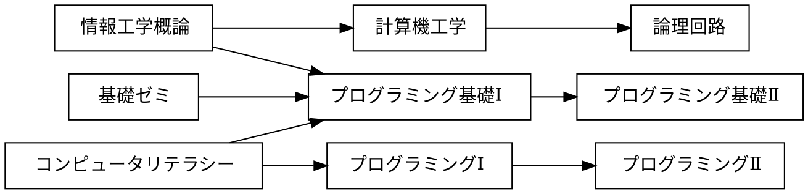

# 課題

## 課題 3.1 有向グラフ


プレビュー結果が上の図のようになるように，下記の記述を完成させよ．(接続関係が正しければ，上下が入れ替わっても構わない)

※ 日本語の文字列に対する箱の大きさが適切でない場合には，前後に空白を入れて調整せよ



## 課題 3.2 WBS


プレビュー結果が上の図のようになるように，下記の記述を完成させよ．(色や影などの違いは気にしなくてよい)

```plantUML
@startwbs ex02
* 拓殖大学
** 商学部
*** 経営学科
*** 国際ビジネス学科
*** 会計学科
** 経済学科
*** 法律政治学科
*** 経済学科
*** 社会安全学科
** 外国語学部
*** 英米語学科
*** 中国語学科
*** スペイン語学科
*** 国際日本語学科
** 工学部
*** 機械システム学科
*** 電子システム学科
*** 情報工学科
*** デザイン学科
** 国際学部
*** 国際学科
@endwbs
```

## 課題 3.3 ユースケース図


プレビュー結果が上の図のようになるように，下記の記述を完成させよ．ただし，別名については適当に設定してよい．(色や影などの違いは気にしなくてよい)

```plantUML
@startuml ex03
left to right direction
actor 学生 as student
actor 教員 as t
rectangle {
    usecase "提出結果の採点" as uc2
    usecase "リポジトリのクローン" as uc3
    usecase "課題ファイルの修正" as uc4
    usecase "修正ステージに上げる" as uc5
    usecase "修正のコミット" as uc6
    usecase "リモートリポジトリにpush" as uc7
    usecase "課題の受領" as uc8
    usecase "課題の登録" as uc1
}
student --> uc8
student --> uc3
student --> uc4
student --> uc5
student --> uc6
student --> uc7
uc1 <-- t
uc2 <--t
@enduml
```

## 課題 3.4 オリジナルの図解

「有向グラフ」「WBS」「ユースケース図」のどれかを使って，
独自の図解を作成せよ．対象は自由に決めてよいが，
誰かのコピーにならないように留意せよ．

```plantUML
@startwbs wbs01
* ポケモン御三家
** 第一世代
*** フシギダネ
*** ヒトカゲ
*** ゼニガメ
** 第二世代
*** チコリータ
*** ヒノアラシ
*** ワニノコ
** 第三世代
*** キモリ
*** アチャモ
*** ミズゴロウ
** 第四世代
*** ナエトル
*** ヒコザル
*** ポッチャマ
** 第五世代
*** ツタージャ
*** ポカブ
*** ミジュマル
** 第六世代
*** ハリマロン
*** フォッコ
*** ケロマツ
** 第七世代
*** モクロー
*** ニャビー
*** アシマリ
** 第八世代
*** サルノリ
*** ヒバニー
*** メッソン
** 第九世代
*** ニャオハ
*** ホゲータ
*** クワッス
@endwbs
```


## チェック
- [x] 課題 3.1 有向グラフ
- [x] 課題 3.2 WBS
- [x] 課題 3.3 ユースケース図
- [x] 課題 3.4 オリジナルの図解
